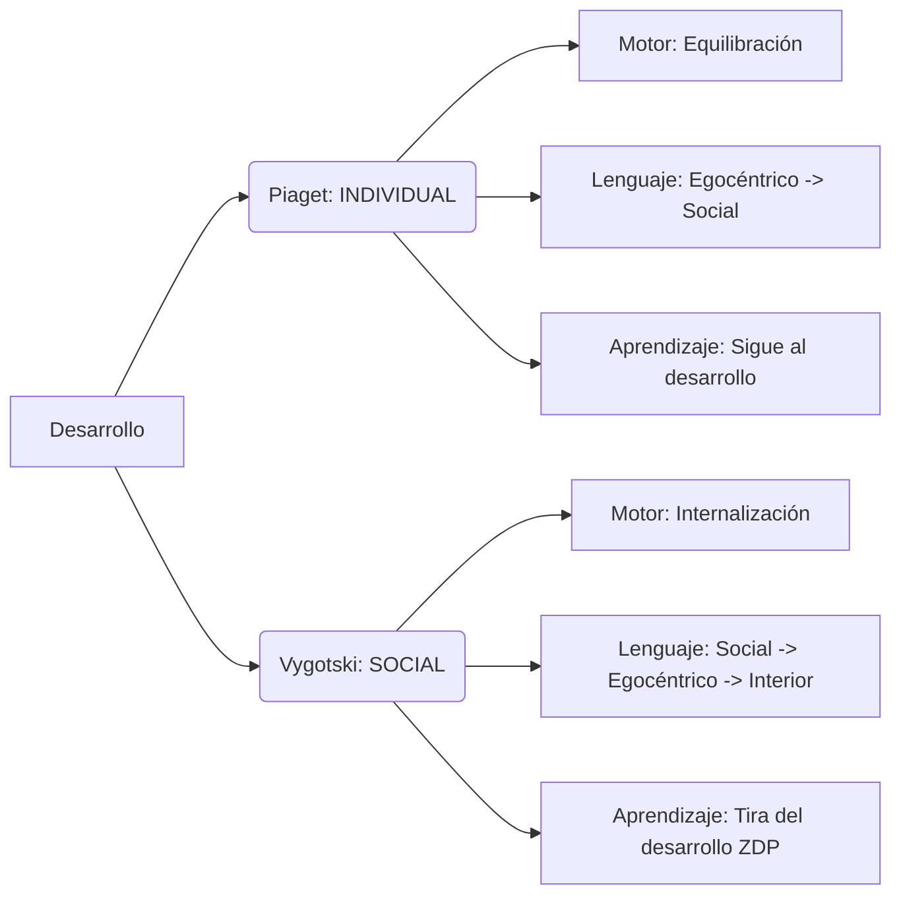

# 📚 Cheatsheet Desarrollo II - Examen

## 📊 1. Análisis del Examen y Estrategia

### 🎯 Distribución de Temas (Basado en Exámenes 2022-2025)
El examen consta de **30 preguntas** tipo test. Para aprobar necesitas **15 aciertos** netos.

| Prioridad | Tema | Frecuencia | % Aprox | Notas Tácticas |
| :--- | :--- | :--- | :--- | :--- |
| 🔴 **ALTA** | **Piaget vs Vygotski** (Caps 1, 2) | 6-8 pregs | 25% | Domina los conceptos de *Equilibración* y *ZDP*. Diferencias en *Lenguaje* y *Aprendizaje*. |
| 🔴 **ALTA** | **Memoria y Funciones Ejecutivas** (Caps 5, 7) | 5-7 pregs | 20% | Diamond (FE), Case (M. Operativa), Estrategias de memoria (Déficits). |
| 🟠 **MEDIA** | **Desarrollo Conceptual** (Cap 4) | 3-5 pregs | 15% | Mandler (Percepto vs Concepto), Teoría de la Teoría, Categorización. |
| 🟠 **MEDIA** | **Razonamiento** (Cap 6) | 3-4 pregs | 12% | Sesgos, Modelos Mentales, Wason, Markovits. |
| 🟠 **MEDIA** | **Desarrollo Moral y Social** (Cap 8, 9) | 3-4 pregs | 12% | Kohlberg (Estadios), Turiel (Moral vs Convencional), Justicia Inmanente. |
| 🟡 **BAJA** | **Metodología** (Cap 3) | 2-3 pregs | 8% | Diseños (Transversal vs Longitudinal vs Secuencial), Validez. |
| 🟡 **BAJA** | **Lectura** (Cap 6) | 1-2 pregs | 5% | Etapas de Frith (Logográfica, Alfabética, Ortográfica). |

### ⚠️ Trampas Comunes en el Examen
*   **Neopiagetianos (Pascual-Leone vs Case):** Ambos hablan de capacidad, pero **Pascual-Leone** dice que la capacidad M *aumenta* biológicamente. **Case** dice que la capacidad total es *constante*, lo que aumenta es la *eficacia* (liberando espacio).
*   **Moral vs Convención (Turiel):** Turiel dice que son dominios *distintos*. Kohlberg los mezclaba.
*   **Justicia Inmanente:** Es creer que "si haces algo malo, te pasará algo malo automáticamente" (propio de niños pequeños/Piaget). NO es justicia divina ni karma adulto.
*   **Déficit de Producción vs Utilización:** *Producción* = no usa la estrategia espontáneamente, pero sí si se le enseña. *Utilización* = la usa, pero no le sirve para mejorar (a veces incluso empeora).

---

## 🔗 2. Mapas Conceptuales Rápidos

### 🧠 Desarrollo Cognitivo: Piaget vs Vygotski

### 🎮 Funciones Ejecutivas (Miyake / Diamond)
*   **Memoria de Trabajo (Updating):** Mantener y manipular info.
*   **Inhibición:** Frenar respuestas automáticas (Test Stroop).
*   **Flexibilidad (Shifting):** Cambiar de tarea/regla.
    *   *Diamond añade:* Planificación y Resolución de problemas (FE Complejas).

### 🚦 Modelos de Lectura (Uta Frith)
1.  **Logográfica:** Reconoce la palabra como un dibujo (Logo de Coca-Cola). *No lee letras.*
2.  **Alfabética:** Conversión Grafema-Fonema (Lee letra a letra: "C-A-S-A").
3.  **Ortográfica:** Reconocimiento rápido de morfemas y palabras completas. *Lectura fluida.*

---

## 📖 3. Diccionario de Términos "Salva-Exámenes" (Glosario)

| Término ⭐ | Definición "Al Grano" | Autor/Teoría |
| :--- | :--- | :--- |
| **Acomodación** | Modificar mis esquemas mentales para que encaje la nueva info. (Cambio yo). | Piaget |
| **Asimilación** | Interpretar la info nueva según mis esquemas viejos. (Deformo la realidad). | Piaget |
| **Equilibración** | Motor del desarrollo. Busco balance entre asimilación y acomodación. | Piaget |
| **Zona Desarrollo Próximo (ZDP)** | Distancia entre lo que hago solo (Real) y lo que hago con ayuda (Potencial). | Vygotski |
| **Andamiaje** | Ayuda temporal y ajustada que da el adulto. Se retira progresivamente. | Bruner/Vygotski |
| **Percepto** | Categoría basada en lo físico/visual (lo que veo). Implícito. | Mandler |
| **Concepto** | Categoría basada en el significado/función (lo que es). Explícito. | Mandler |
| **Justicia Inmanente** | Creencia infantil de que la naturaleza castiga las faltas automáticamente. | Piaget (Moral) |
| **Realismo Moral** | Las normas son sagradas y externas. Se juzga por el daño, no la intención. | Piaget (Heterónoma) |
| **Responsabilidad Objetiva** | Juzgar por el resultado material (rompió 5 tazas sin querer > 1 queriendo). | Piaget |
| **Responsabilidad Subjetiva** | Juzgar por la intención (rompió 1 taza queriendo > 5 sin querer). | Piaget |
| **Teoría de la Mente (ToM)** | Capacidad de atribuir creencias/deseos a otros (saber que pueden mentir). | Metacognición |
| **Falsa Creencia** | Test para medir ToM. (Sally y Ana). Se supera a los 4 años. | Wimmer y Perner |
| **Metacognición** | Pensar sobre el propio pensamiento (conocer y controlar). | Flavell |
| **Inhibición** | Capacidad de no hacer lo automático. Clave en Funciones Ejecutivas. | Diamond |
| **Epigénesis** | Desarrollo por interacción bidireccional Genes ↔ Ambiente. | Neuroconstructivismo |

---

## 👤 4. Autores y sus "Hits"

*   **PIAGET:** Estadios universales. El niño científico solitario. Moral Heterónoma -> Autónoma.
*   **VYGOTSKI:** Origen social. Ley de doble formación (Inter -> Intra). Lenguaje como herramienta.
*   **KOHLBERG:** 3 Niveles morales (Pre, Convencional, Post). Dilema de Heinz. Justicia como equidad.
*   **TURIEL:** Distingue Moral (daño/justicia) de Convención Social (normas arbitrarias: comer con manos).
*   **MANDLER:** Análisis Perceptivo (inconsciente) vs Análisis Conceptual (consciente).
*   **ROSCH:** Categorización. Nivel Básico (Perro) es el primero que se aprende, antes que Supra (Animal) o Sub (Caniche).
*   **CASE (Neopiagetiano):** Espacio Total de Procesamiento (ETP) es fijo. Aumenta la Eficacia Operativa -> libera Memoria a Corto Plazo.
*   **PASCUAL-LEONE (Neopiagetiano):** La capacidad mental (M) crece biológicamente cada 2 años.
*   **DIAMOND:** Funciones Ejecutivas dependen de corteza prefrontal. Inhibición es clave.
*   **TOMASELLO:** Lo humano es la "Intencionalidad Compartida" y la cultura.

---

## 📈 5. Estadios del Desarrollo (Resumen Visual)

### Estadios Cognitivos (Piaget) - Mnemónico: "Se Pre-Ocupa Fuerte"
1.  **Sensoriomotor (0-2):** Sentidos y acción. Logro: *Permanencia del objeto*.
2.  **Preoperacional (2-7):** Símbolos y lenguaje. *Egocentrismo*. *Centración*. No conserva.
3.  **Op. Concretas (7-11):** Lógica con objetos reales. *Conservación*. *Reversibilidad*.
4.  **Op. Formales (11+):** Hipótesis, abstracto. *Pensamiento científico*.

### Estadios Morales (Kohlberg) - Mnemónico: "Pre-Con-Post"
1.  **Preconvencional (Infancia):**
    *   E1: Obediencia/Castigo (Evitar dolor).
    *   E2: Interés propio (Tú me das, yo te doy).
2.  **Convencional (Adolescencia):**
    *   E3: El "buen chico" (Qué dirán los demás/familia).
    *   E4: Ley y Orden (Normas sociales rígidas).
3.  **Postconvencional (Adulto - raro):**
    *   E5: Contrato Social (Derechos humanos).
    *   E6: Principios Éticos Universales (Justicia sobre ley).

---

## 🎴 6. Flashcards de Alta Frecuencia (Basadas en Exámenes Reales)

---
**PREGUNTA 2022:** Según Case, ¿qué cambia con la edad en la memoria operativa?
**RESPUESTA:** La **eficacia** del procesamiento. (NO la capacidad total).
**PISTA:** Case = "Casi" igual capacidad, pero más eficiente. Eficacia libera espacio.
---
**PREGUNTA 2023:** ¿Cuál es la diferencia entre categorías perceptivas y conceptos según Mandler?
**RESPUESTA:** Los conceptos tienen formato **declarativo/explícito**; los perceptos son procedimentales/implícitos.
**PISTA:** Concepto = Consciencia (Declarativo). Percepto = Procedimental.
---
**PREGUNTA 2024:** ¿Qué técnica se usa para estudiar la memoria en bebés desde los 2 meses?
**RESPUESTA:** La **imitación diferida** (o habituación). Muestra recuerdo tras un intervalo.
**PISTA:** Diferida = Diferente tiempo (recuerdo posterior).
---
**PREGUNTA:** Un niño dice que es peor romper 5 tazas sin querer que 1 queriendo. ¿Qué tipo de responsabilidad es?
**RESPUESTA:** Responsabilidad **Objetiva**.
**PISTA:** Objetivo = Objeto (cuenta los objetos rotos). Subjetivo = Sujeto (cuenta la intención).
---
**PREGUNTA:** En la lectura, ¿qué etapa reconoce las palabras como dibujos o logos?
**RESPUESTA:** Etapa **Logográfica**.
**PISTA:** Logo = Logográfica.
---
**PREGUNTA:** ¿Qué crítica se le hace a Kohlberg sobre el estadio Postconvencional?
**RESPUESTA:** Que es **escaso** en adultos y tiene sesgo cultural occidental.
**PISTA:** Post = Postureo filosófico (pocos llegan).
---
**PREGUNTA:** Según Vygotski, ¿cuál es la dirección del desarrollo del lenguaje?
**RESPUESTA:** Social → Egocéntrico → Interior.
**PISTA:** Vygotski va de FUERA (social) a DENTRO (interior). Piaget va al revés (de dentro a fuera).
---
**PREGUNTA:** ¿Qué es un "déficit de utilización" en estrategias de memoria?
**RESPUESTA:** El niño usa la estrategia, pero **no mejora** su rendimiento.
**PISTA:** La "utiliza" pero "pa ná".
---
**PREGUNTA:** Según Piaget, el conflicto cognitivo es...
**RESPUESTA:** El motor del cambio (necesario para la equilibración).
**PISTA:** Sin conflicto no hay avance. Desequilibrio -> Reequilibración.
---
**PREGUNTA:** ¿En qué consisten los diseños secuenciales?
**RESPUESTA:** Combinan transversales y longitudinales para controlar el **efecto de cohorte** (generación).
**PISTA:** Secuencial = "Secuencia" de generaciones.

---

## 🧠 7. Mnemotécnicos en Español

### Para las Estrategias de Memoria: "ROE"
*   **R**epetición (Básica)
*   **O**rganización (Agrupar)
*   **E**laboración (Crear historias - la mejor)

### Para los componentes de la Moral de Piaget: "ReJus"
*   **Re**alismo Moral (Norma física)
*   **Jus**ticia Inmanente (Castigo automático)
*   **Responsabilidad** Objetiva (Resultado > Intención)

### Para los niveles de Lectura (Frith): "LOA"
*   **L**ogográfica (Dibujos)
*   **A**lfabética (Letras/Sonidos)
*   **O**rtográfica (Fluidez)
*(Ojo: A veces se enseña Logográfica -> Alfabética -> Ortográfica)*

### Para Teoría de la Mente (Pasos): "De-Cre-Fal"
1.  **De**seos (2 años)
2.  **Cre**encias verdaderas (3 años)
3.  **Fal**sas creencias (4 años - El hito clave)

---

## 📝 8. Resumen de Metodología (Preguntas "Regalo")

*   **Diseño Transversal:** Varios grupos de edades distintas a la vez. (Foto fija).
    *   *Ventaja:* Rápido. *Problema:* No ve el cambio intraindividual. Confunde edad con generación (cohorte).
*   **Diseño Longitudinal:** Mismo grupo a lo largo del tiempo. (Película).
    *   *Ventaja:* Ve el cambio real. *Problema:* Lento, caro, mortandad experimental (la gente se va).
*   **Diseño Secuencial:** Mezcla los dos. Controla el **Efecto de Cohorte** (generacional).
*   **Microgenético:** Vygotskiano. Observar el cambio *mientras ocurre* (sesiones intensivas cortas).
*   **Validez Interna:** ¿El experimento está bien hecho? (Control de variables).
*   **Validez Externa:** ¿Se puede generalizar a la vida real? (Validez ecológica).

---

## 📅 Consejos de Última Hora
1.  Si la pregunta habla de **"liberar recursos"** o **"eficacia"**, la respuesta es **Case**.
2.  Si habla de **"Reglas vs Principios"** o **"Convención"**, piensa en **Turiel**.
3.  Si habla de **"Inhibición"** o **"Prefrontal"**, es **Funciones Ejecutivas (Diamond)**.
4.  En Piaget, la respuesta suele ser **"Cualitativo"** y **"General"**.
5.  En Vygotski, la respuesta suele implicar **"Mediación"** o **"Herramientas culturales"**.
6.  **Moral:** Si respeta la norma por "miedo" es Preconvencional. Si es por "quedar bien" es Convencional. Si es por "justicia universal" es Postconvencional.

¡Mucha suerte! Este examen es de **conceptos**, no de memoria pura. Entiende la lógica del autor.
